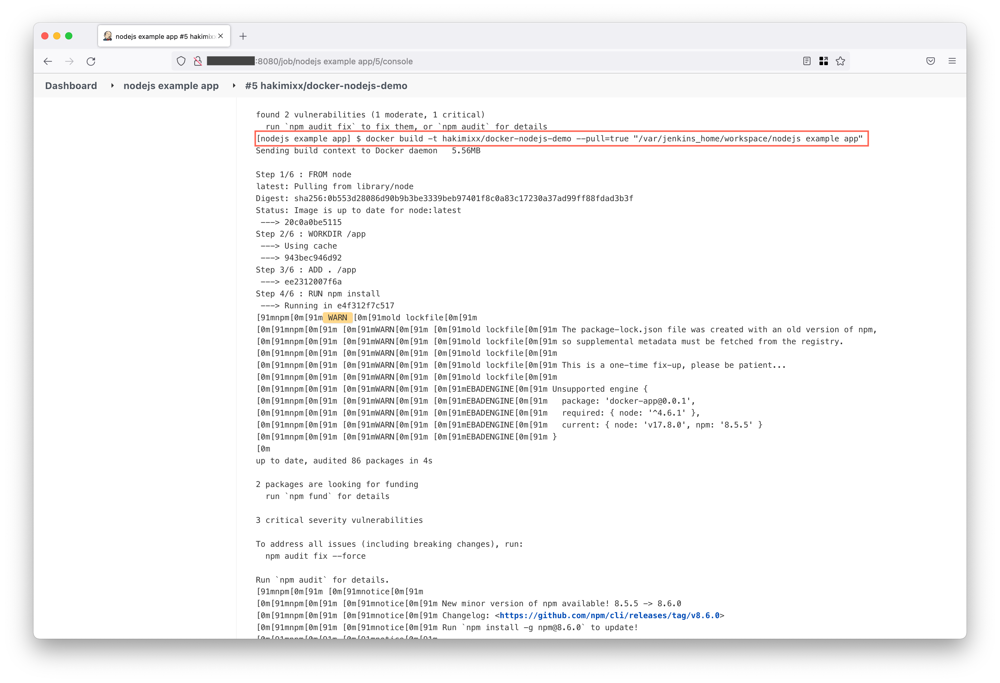
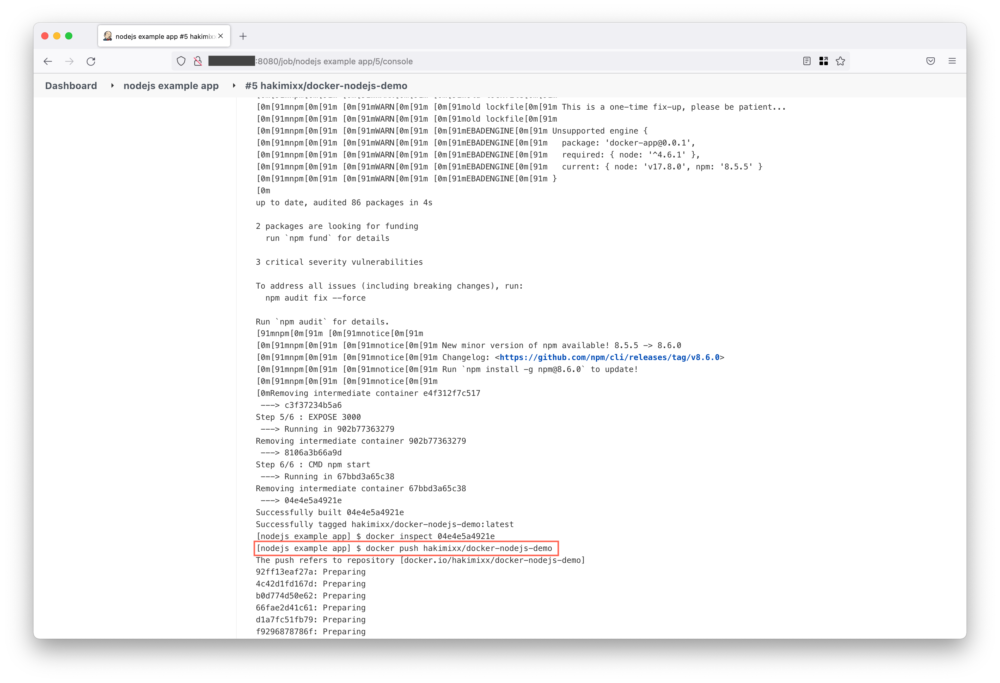

# Jenkins Workflow

* [Install Jenkins](#install-jenkins)
  * [DigitalOcean](#digitalocean)
  * [Download Docker and install Jenkins](#download-docker-and-install-jenkins)
* [Build and deploy application](#build-and-deploy-application)
  * [Package the app in docker](#package-the-app-in-docker)

### Install Jenkins
Install Jenkins on the Cloud using Docker (DigitalOcean).

#### DigitalOcean
Setup DigitalOcean droplet and ssh into the machine: 
```shell
ssh root@<ip-address>
```

#### Download Docker and install Jenkins 
Run the `scripts/install_jenkins.sh` script inside the machine:
```shell
bash install_jenkins.sh
```
Docker will pull the official jenkins image and run the container:
```text
Jenkins installed
You should now be able to access jenkins at: http://<ip-address>:8080
```
_The initial admin password can be found in `/var/jenkins_home/secrets/initialAdminPassword`_

#### Install Docker on the host machine
Run the following docker image as a container in the DigitalOcean machine, 
to get access to the Docker client, and to expose the Docker socket, so we can access 
the Docker API on the machine.
```shell
# clone the repo 
git clone https://github.com/HakimiX/jenkins-image
 
# build the image
 docker build -t jenkins-docker .

# Remove the old jenkins:latest image and use the new image
docker rm jenkins

# build and start the new image
docker run -p 8080:8080 -p 50000:50000 -v /var/jenkins_home:/var/jenkins_home -v /var/run/docker.sock:/var/run/docker.sock --name jenkins -d jenkins-docker
```
Jenkins will use the existing volume and restart.

**Pull images**<br>
Pull an image from docker hub in the host machine: 
```shell
docker pull hakimixx/docker-nodejs-demo
```
Start the container: 
````shell
docker run -p 3000:3000 -d hakimixx/docker-nodejs-demo
````
Navigate to the host IP
```shell
http://<ip-address>:3000
```
Or use curl in the machine 
```shell
curl http://localhost:3000
```

### Build and deploy application
Building the app on Jenkins will:
* Install dependencies
* Build and push the application to docker hub:




#### Package the app in Docker
Create a container that includes the Node.js binaries and the app. 
This ensures that the code will **behave in the same way** on the production
system as in the non-production environments.

### Jenkins Plugins 

* Nodejs
* CloudBees Docker Build and Publish
* Jenkins Job DSL


### Jenkins Job DSL
[API documentation](https://jenkinsci.github.io/job-dsl-plugin/)
